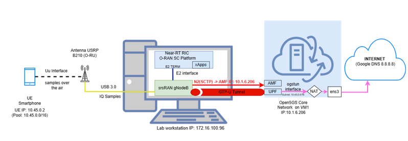

# Experimental Deployment of an End-to-End O-RAN Testbed with xApp Development in Near-RT RIC Environment for Dynamic Radio Resource Management and 5G Network Decongestion

## Diploma Thesis | University of Patras

Department of Electrical and Computer Engineering
Author: Panagiota Panagiotopoulou (A.M. 1083759)
Supervisor: Prof. Spyridon Denazis
Co-Examiners: Prof. Alexios Birbas, Prof. Odysseas Koufopavlou
Defense Date: February 2026

## Project Overview

This repository hosts the implementation of a complete, disaggregated, software-based 5G Standalone (SA) network following the O-RAN Alliance specifications.

The core contribution of this thesis is the Smart RC xApp, an intelligent control application executing within a Near-Real-Time RAN Intelligent Controller (Near-RT RIC) platform. By continuously monitoring real-time Downlink Throughput ($DRB.UEThpDl$) via the E2 interface, the xApp implements a closed-loop control mechanism utilizing a rolling Z-Score anomaly detection algorithm. Upon detecting sudden traffic spikes, it proactively mitigates congestion by dynamically adjusting physical resource constraints (PRB Throttling) on the gNodeB's MAC Scheduler, ensuring Quality of Service (QoS) stability.

## Watch the Live Demo Video on YouTube: 
https://youtu.be/3G7O6QQr06Q?si=I076kYnc8y9rLbsJ

## System Architecture & Hybrid Functional Split

The experimental testbed disaggregates the traditional monolithic RAN into standard-compliant entities distributed across cloud VMs and local edge hardware:

5G Core Network (5GC): Powered by Open5GS running on a Cloud VM (Ubuntu Server). Subscriber database profiles are stored in MongoDB and provisioned via a custom WebUI accessed using secure SSH Tunneling.

O-RAN gNodeB: Built using the srsRAN Project, disaggregated into a Centralized Unit (O-CU) and a Distributed Unit (O-DU), embedding a native E2 Agent.

Open Radio Unit (O-RU): Handled by an Ettus USRP B210 Software Defined Radio (SDR) transceiver connected via a high-speed USB 3.0 interface.

Near-RT RIC: Deployed via Docker Compose containers (O-RAN SC platform microservices), facilitating low-latency routing through the RMR (RIC Message Router) bus.

## The Hybrid Functional Split Approach

To overcome local FPGA limitations on SDR hardware while maintaining granular scheduling control, we developed a hybrid split architecture:

Split 7.2x (Logical Layer - High-PHY / MAC): All scheduling decisions and high-level physical layer processing are executed in software (O-DU CPU).This enables the xApp to dynamically intercept and alter the MAC Scheduler parameters in near-real-time.

Split 8 (Physical/Transport Layer - Low-PHY / RF): Time-domain baseband I/Q samples are transferred via USB 3.0 from the workstation (emulating Low-PHY in software) to the USRP B210, which handles raw RF transmission over 5G NR Band n78 (3.5 GHz TDD) with a 20 MHz bandwidth.
## Smart RC xApp Closed-Loop Logic

The xApp orchestrates a low-latency MAPE-K (Monitor-Analyze-Decide-Act) loop[cite: 1, 2]:

       +--------------------------------------------+
       |                  Near-RT RIC               |
       |  +------------------+   +---------------+  |
       |  |   Smart RC xApp  |-->|  Redis DBaaS  |  |
       |  +------------------+   +---------------+  |
       |         ^        |                         |
       |         | KPM    | RC                      |
       |         | (12050)| (12040)                 |
       +---------|--------|-------------------------+
                 |        v
       +---------|--------|-------------------------+
       |    E2   |        | srsRAN gNodeB           |
       |  +------|--------v-----+                   |
       |  |       E2 Agent      |                   |
       |  +---------------------+                   |
       |  |    O-CU (Control)   |                   |
       |  +---------------------+                   |
       |  |   O-DU (Scheduler)  |                   |
       +--+---------------------+-------------------|

### 1. Monitor (E2SM-KPM)

The xApp establishes an E2 Subscription ($RIC\_SUB\_REQ$) to the O-DU's E2 Agent. The gNodeB continuously measures the downlink user throughput ($DRB.UEThpDl$) at a granularity period of 1000ms and streams it back to the xApp via $RIC\_INDICATION$ (RMR type 12050) packets.

### 2. Analyze (Sliding Window & Z-Score)

Incoming measurements ($x_i$) are pushed to a First-In-First-Out (FIFO) Sliding Window list storing exactly the $20$ most recent samples. The xApp computes the rolling mean ($\mu$) and standard deviation ($\sigma$) to derive the statistical Z-Score:

$$Z_{score} = \frac{x_i - \mu}{\sigma}$$

This allows the xApp to dynamically distinguish between normal network jitter (within-limit noise) and actual traffic anomalies.

### 3. Decide & Act (E2SM-RC)

### Congestion State: If the condition $|Z_{score}| > 2.0$ is met, a traffic spike (anomaly) is detected. The xApp immediately calculates a throttled PRB threshold:

$$\text{New PRB Limit} = \max\left(10, \lfloor \text{Current Limit} \times 0.8 \rfloor\right)$$

This value is wrapped into an E2SM-RC Control Message (Format 1 encoded via ASN.1 PER rules) and dispatched over the E2 interface as an RMR 12040 (RIC_CONTROL_REQ).

### Recovery State: When the Z-Score returns to the $[-2.0, 2.0]$ range, the scheduler gradually restores resources in incremental steps of $+5$ PRBs per cycle until it reaches full capacity ($100\%$).

## End-to-End Testbed Setup       


## Repository Structure
 
```text
my_thesis_O-RAN/
├── oran-sc-ric/              
│   ├── xApps/
│   │   └── python/            
│   │       ├── my_smart_rc_xapp.py      # Main xApp with Z-Score logic
│   │       ├── live_dashboard.py        # Real-time visualization dashboard
│   │       ├── e2sm_kpm_module.py       # Helper lib for E2SM-KPM (encoding/decoding)
│   │       └── e2sm_rc_module.py        # Helper lib for E2SM-RC (encoding/decoding)
│   ├── docker-compose.yml      # Docker Compose file to orchestrate the RIC containers
│   └── configs/                # Configuration files for RIC entities (e.g., routes.rtg)
│
├── srsRAN_Project/              # Customizations for the srsRAN gNB
│   └── configs/
│       └── tested_configs/      # Tested configuration files
│           ├── cu_E2.yml                      # O-CU configuration with E2 enabled
│           └── du_rf_b200_tdd_n78_20mhz_E2.yml # O-DU configuration for USRP B210 with E2 enabled
│
├── core/                         # Customizations for the Open5GS Core Network
│   └── etc/
│       └── open5gs/              # Modified core network configurations
│           ├── amf.yaml           # AMF configuration with PLMN, TAC, and network bindings
│           └── upf.yaml           # UPF configuration for N3 interface and NAT
│
└── README.md                    
 
 ```
## This project is based on the following open source implementations:
1.Guide for installing and configuring Open5GS Core Network:
https://open5gs.org/  
https://open5gs.org/open5gs/docs/guide/01-quickstart/ (Open5GS Documentation)
2.SC-RIC integration for Near-RT RIC and example Python xApps:
https://github.com/srsran/oran-sc-ric
3.srsRAN Project: Implements the O-RAN gNodeB (O-CU and O-DU) with an embedded E2 Agent.
https://docs.srsran.com/en/latest/
 
 
The core contribution of this thesis, the my_smart_rc_xapp.py, runs on Near-RT RIC. It subscribes to Key Performance Measurements (KPMs) from the gNB via the E2 interface,
analyzes downlink throughput (DRB.UEThpDl) using a Z-Score algorithm with a sliding window, and sends RAN Control (RC) messages to dynamically throttle Physical Resource
Blocks (PRBs) when congestion is detected.

  
## Hardware Requirements:
 
Lab Workstation Dell OptiPlex 7060 (or equivalent) with Intel Core i7-8700, 16GB RAM, Ubuntu 22.04
Core Network VM Separate machine or VM with Ubuntu Server, 4GB+ RAM
SDR (O-RU)  USRP B210 with USB 3.0 connection
User Equipment (UE) 5G-compatible smartphone (e.g., Samsung Galaxy A17 5G)
SIM Card    Programmable SIM card with IMSI: 001010000000001
 
## Software Requirements:
 
Software           Version      Purpose
Docker           20.10+         Container runtime for Near-RT RIC
Docker Compose   2.0+           Orchestration of RIC containers
Python           3.8+           For xApp development and dashboard
Open5GS          2.7+           5G Core Network
srsRAN Project   23.10+         O-RAN gNodeB with E2 Agent
MongoDB          8.0+           Subscriber database for Open5GS
UHD Drivers      4.5+           Drivers for USRP B210
 
---
 
## Startup Sequence (Execution Guide)
 
Follow the steps below in the exact order to ensure proper synchronization between the network entities.
 
 
### 1. Start the Core Network (Open5GS)
Connect to the Core Network VM and restart all services:
 
```bash
sudo systemctl restart open5gs-amfd open5gs-smfd open5gs-upfd open5gs-nrfd open5gs-ausfd open5gs-udmd open5gs-udrd open5gs-pcfd open5gs-nssfd open5gs-bsfd open5gs-scpd
```
 
Verification: Run this command to ensure the core amf service is active
```bash
sudo systemctl status open5gs-amfd
```
 
 
### 2. Start Near-RT RIC
On the Lab Workstation, deploy the RIC:
```bash
cd ~/clean/oran-sc-ric
docker compose down
docker compose up -d
docker ps
```
 
 
### 3. Start srsRAN gNodeB (CU & DU)
Open two separate terminals on the Lab Workstation.
 
Terminal 1 (O-CU):
```bash
cd ~/clean/srsRAN_Project/build/apps/cu
sudo ./srscu -c /home/panagiotopoulou/clean/srsRAN_Project/configs/tested_configs/cu_E2.yml
```
 
Terminal 2 (O-DU):
```bash
cd ~/clean/srsRAN_Project/build/apps/du
sudo ./srsdu -c /home/panagiotopoulou/clean/srsRAN_Project/configs/tested_configs/du_rf_b200_tdd_n78_20mhz_E2.yml
```
 
 
### Commands to run an xApp
Requirement: The docker compose from /home/panagiotopoulou/clean/oran-sc-ric/docker-compose.yml must already be running (Step 2).
### Run the Smart Control xApp (Z-Score logic)
```bash
cd /home/panagiotopoulou/clean/oran-sc-ric
docker compose exec python_xapp_runner ./my_smart_rc_xapp.py --metrics=DRB.UEThpDl,DRB.UEThpUl --kpm_report_style=1
```
 
### Run the Live Dashboard
To see real-time visualization and throughput graphs:
```bash
cd /home/panagiotopoulou/clean/oran-sc-ric/xApps/python
python3 live_dashboard.py
```
 
### Access: Open your browser at http://127.0.0.1:8988

